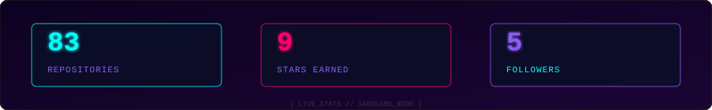
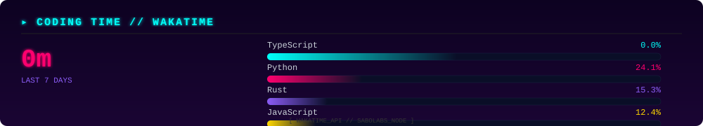
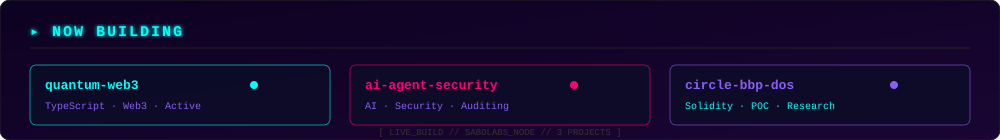

  

 

  

<!-- WAKATIME -->

## ▸ CODING TIME

 

  

<!-- NOW BUILDING -->

## ▸ NOW BUILDING

 

  

<!-- STREAK -->

## ▸ CONTRIBUTION HEAT

  
  

 

  

<!-- SNAKE -->

## ▸ CONTRIBUTION SNAKE

 

  

<!-- STATS + LANGS -->

## ▸ STATISTICS

  

 

  

<!-- FEATURED PROJECT -->

## ▸ FEATURED

 

  

<!-- TECH STACK -->

## ▸ TECH STACK

  

 

  

<!-- SOCIALS -->

## ▸ UPLINK

  
  
  

 
<pre>
   ╔══════════════════════════════════════════╗
   ║  「コードは詩、夜は永遠」                  ║
   ║  Code is poetry. Night is eternal.        ║
   ╚══════════════════════════════════════════╝
</pre>

 
⚡ SaboLabs Cyberpunk Dev · 2026 ⚡

