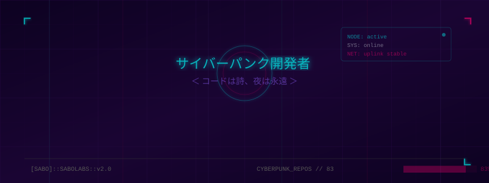

<!-- CYBERPUNK TOKYO HEADER — ORIGINAL SVG -->

 

<!-- STATUS BADGES -->

  
  
  
  

 

<!-- ABOUT -->

## `▶ whoami`

<table>
  <tr>
    <td width="55%" valign="top">

<pre>
<b>Node ID</b>      :: sabo
<b>Affiliation</b>  :: SaboLabs Security
<b>Role</b>         :: Full Stack Dev · AI Engineer
<b>OS</b>           :: Arch btw · VSCode · Neovim
<b>Stack</b>        :: TypeScript · Solidity · Python · Rust
<b>Focus</b>        :: AI agents · Web3 · automation
<b>Status</b>       :: ⬤ Online — accepting connections
</pre>

    </td>
    <td width="45%" valign="top">

<pre>
<b>> cat /etc/mission</b>

  Build autonomous systems.
  Ship Web3 + AI infra at scale.
  Red-team the matrix.
  Never sleep on mainnet.
  Code is poetry.
  Night is eternal.

  「未来をハックする」
</pre>

    </td>
  </tr>
</table>

 

<!-- TECH STACK -->

## `⚡ power_grid — stack`

  

### ◢ ai / agent layer

  <code>Hermes</code>  <code>OpenAI</code>  <code>LangChain</code>  <code>Claude API</code>  <code>Web3</code>

### ◢ security / infra

  <code>Linux</code>  <code>Docker</code>  <code>PostgreSQL</code>  <code>Redis</code>  <code>Nginx</code>  <code>Cloudflare</code>

 

<!-- STATS -->

## `📊 data_stream`

  
  

  

 

<!-- PROJECTS -->

## `🚀 active_nodes`

| Project | Description | Stack |
|:--------|:------------|:-----:|
| <a href="https://github.com/naninu123/quantum-web3">⚛ quantum-web3</a> | Quantum-inspired Web3 patterns | TypeScript |
| <a href="https://github.com/naninu123/ai-agent-security">🛡 ai-agent-security</a> | LLM red-teaming toolkit | TypeScript |
| <a href="https://github.com/naninu123/circle-bbp-dos-poc">🔴 circle-bbp-dos</a> | Solidity DoS PoC | Solidity |
| <a href="https://github.com/naninu123/nebula-swap">🌌 nebula-swap</a> | Web3 DEX interface | HTML/JS |
| <a href="https://github.com/naninu123/address-tracker">📍 address-tracker</a> | Wallet monitoring | TypeScript |

 

 

<!-- SOCIALS -->

## `📡 uplink`

  
  
  

  

 

<pre align="center">
   ╔══════════════════════════════════════════╗
   ║  「コードは詩、夜は永遠」                  ║
   ║  Code is poetry. Night is eternal.        ║
   ╚══════════════════════════════════════════╝
</pre>

 
⚡ SaboLabs Cyberpunk Dev · 東京 2026 ⚡

